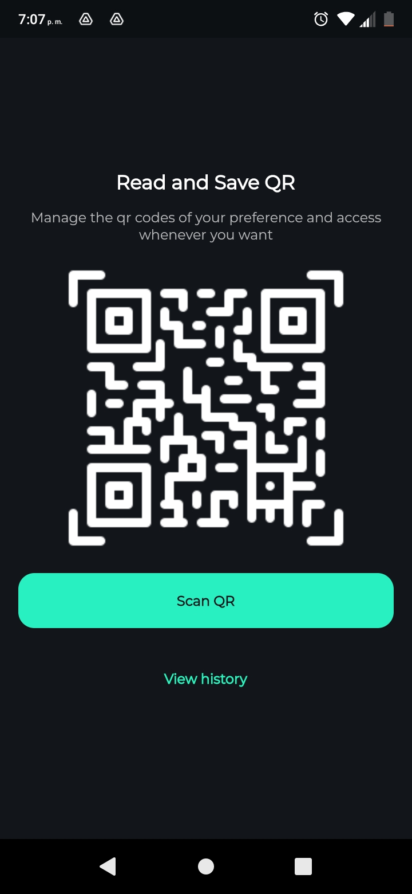
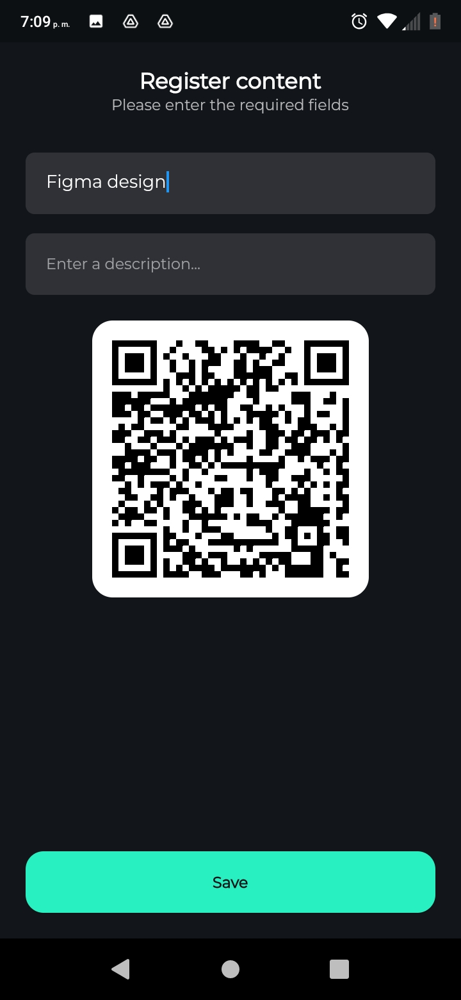

# Read and Save QR
A mobile application to scan QR codes, save them, enter the QR link. 


## Development 

### Project structure

In the `assets` folder are all the files used by the application.

- **themes:** Files that contain the theme of the application.
- **screen:** The screen that the user can see.
- **widget:** They are like components, the screen folder depends on them.
- **models:** Models i use in db folder.
- **db:** I use it as a database in the application.


### My experience developing
When developing the application I did not have many problems, even so I think I could have added a few more things, since each QR code that is saved cannot be edited or deleted. Anyway I think I learned a little more about databases.

### Technologies used in the project

1. [Flutter](https://flutter.dev/)
2. [Dart](https://dart.dev/)
#### Flutter package
- [google_fonts](https://pub.dev/packages/google_fonts)
- [qr_code_scanner](https://pub.dev/packages/qr_code_scanner)
- [qr_flutter](https://pub.dev/packages/qr_flutter)
- [intl](https://pub.dev/packages/intl)
- [sqflite](https://pub.dev/packages/sqflite)
- [path](https://pub.dev/packages/path)
- [path_provider](https://pub.dev/packages/path_provider)
- [url_launcher](https://pub.dev/packages/url_launcher)


## Demo 

You can see the app running, just open the terminal and enter the following commands:
```
git clone https://github.com/YerikAH/read-and-save-qr.git
cd read-and-save-qr
flutter run
```
If you want to try the application on android you can see [releases](https://github.com/YerikAH/read-and-save-qr/releases/tag/app), and download the apk, it weighs 20MB.

### Screenshots





## Author

- Harvey Yerik

    - [Twitter](https://twitter.com/yerikhar)
    - [GitHub](https://github.com/YerikAH)
    - [Send Me A Message](https://yerikah.github.io/send-me-a-message/dist/)
